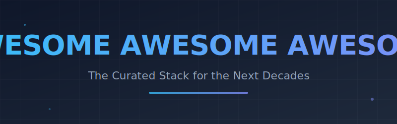

<!-- SEO Meta Tags -->
<meta name="description" content="Awesome Awesome Awesome - A curated list of the most important tools, frameworks, and resources for AI, Robotics, Biotech, Quantum, and Space Tech defining the next several decades.">
<meta name="keywords" content="AI, Machine Learning, Generative AI, Robotics, Drones, Computational Biology, Drug Discovery, Chip Design, EDA, Quantum Computing, Space Tech, Future Tech, Awesome List">

  
   
  <h1>🚀 Awesome Awesome Awesome 🤖</h1>
  

    
    
    
    
  

   
  

    <b>💎 A curated list of the most important tools, frameworks, papers, datasets, and resources for the technologies defining the next several decades. 💎</b>
  

  

    <i>🛰️ Not for web devs. For builders of the future. 🧬</i>
  

  

> **Scope:** AI/ML, Generative AI, Robotics, Drones, Computational Biology, Computational Chemistry, EDA & Chip Design, Semiconductor Ecosystems, Computational Energy, Extended Reality (XR), Quantum Computing, Space Tech, and more — all technologies with outsized impact in the coming decades.

> **Format:** Each entry is `[Name](url) — Brief, honest description of why it matters.`

> Inspired by [sindresorhus/awesome](https://github.com/sindresorhus/awesome). Maintained at [ishandutta2007/awesome-awesome-awesome](https://github.com/ishandutta2007/awesome-awesome-awesome).

---

## Contents

- [AI Foundations](#ai-foundations)
  - [LLMs & Foundation Models](#llms--foundation-models)
  - [Inference Engines & Runtimes](#inference-engines--runtimes)
  - [Training Frameworks](#training-frameworks)
  - [Fine-tuning & Alignment](#fine-tuning--alignment)
  - [LLM Evaluation](#llm-evaluation)
  - [LLM Ops & Deployment](#llm-ops--deployment)
  - [Prompt Engineering & Tooling](#prompt-engineering--tooling)
  - [RAG & Vector Databases](#rag--vector-databases)
  - [AI Agents & Orchestration](#ai-agents--orchestration)
  - [Vibe Coding & AI-Native IDEs](#vibe-coding--ai-native-ides)
- [Generative AI](#generative-ai)
  - [Image Generation](#image-generation)
  - [Video Generation](#video-generation)
  - [Audio & Music Generation](#audio--music-generation)
  - [3D & Scene Generation](#3d--scene-generation)
  - [Multimodal Models](#multimodal-models)
- [Robotics](#robotics)
  - [Robot Operating Systems & Middleware](#robot-operating-systems--middleware)
  - [Robot Simulation](#robot-simulation)
  - [Robot Learning & RL](#robot-learning--rl)
  - [Manipulation & Grasping](#manipulation--grasping)
  - [Humanoid Robotics](#humanoid-robotics)
  - [Robot Perception](#robot-perception)
- [Drone & Aerial Mobility](#drone--aerial-mobility)
  - [Flight Controllers & Autopilots](#flight-controllers--autopilots)
  - [Drone Simulation](#drone-simulation)
  - [Swarm & Multi-Vehicle](#swarm--multi-vehicle)
  - [Urban Air Mobility (UAM)](#urban-air-mobility-uam)
- [Computational Biology](#computational-biology)
  - [Protein Structure & Folding](#protein-structure--folding)
  - [Genomics & Sequencing](#genomics--sequencing)
  - [Drug Discovery](#drug-discovery)
  - [Single-Cell Analysis](#single-cell-analysis)
  - [Systems Biology](#systems-biology)
  - [Synthetic Biology](#synthetic-biology)
  - [Bioinformatics Pipelines](#bioinformatics-pipelines)
- [Computational Chemistry](#computational-chemistry)
  - [Molecular Dynamics](#molecular-dynamics)
  - [Quantum Chemistry](#quantum-chemistry)
  - [Materials Science Simulation](#materials-science-simulation)
  - [Cheminformatics](#cheminformatics)
  - [AI for Chemistry](#ai-for-chemistry)
- [Chip Design & EDA](#chip-design--eda)
  - [Open-Source EDA Tools](#open-source-eda-tools)
  - [Hardware Description Languages](#hardware-description-languages)
  - [FPGA Toolchains](#fpga-toolchains)
  - [AI-Assisted Chip Design](#ai-assisted-chip-design)
  - [Verification & Formal Methods](#verification--formal-methods)
- [Semiconductor Ecosystem](#semiconductor-ecosystem)
  - [Process Design Kits (PDKs)](#process-design-kits-pdks)
  - [Open Silicon Initiatives](#open-silicon-initiatives)
  - [RISC-V Ecosystem](#risc-v-ecosystem)
  - [GPU & Accelerator Programming](#gpu--accelerator-programming)
  - [Neuromorphic Computing](#neuromorphic-computing)
- [Computational Energy](#computational-energy)
  - [Grid Simulation & Optimization](#grid-simulation--optimization)
  - [Renewable Energy Modeling](#renewable-energy-modeling)
  - [Battery & Storage Simulation](#battery--storage-simulation)
  - [Energy Systems AI](#energy-systems-ai)
- [Extended Reality (XR)](#extended-reality-xr)
  - [VR/AR Engines & SDKs](#vrar-engines--sdks)
  - [Spatial Computing](#spatial-computing)
  - [Neural Rendering & NeRF](#neural-rendering--nerf)
  - [Haptics](#haptics)
- [Quantum Computing](#quantum-computing)
  - [Quantum Frameworks](#quantum-frameworks)
  - [Quantum Simulation](#quantum-simulation)
  - [Quantum Error Correction](#quantum-error-correction)
- [Space Technology](#space-technology)
  - [Orbital Mechanics & Astrodynamics](#orbital-mechanics--astrodynamics)
  - [Satellite Software](#satellite-software)
  - [Space AI & Remote Sensing](#space-ai--remote-sensing)
- [Edge & Embedded AI](#edge--embedded-ai)
- [Autonomous Vehicles](#autonomous-vehicles)
- [AI Safety & Alignment Research](#ai-safety--alignment-research)
- [Open Datasets for Future Tech](#open-datasets-for-future-tech)
- [Research Paper Hubs](#research-paper-hubs)
- [Communities & Conferences](#communities--conferences)

---

## AI Foundations

### LLMs & Foundation Models

- [LLaMA (Meta)](https://github.com/meta-llama/llama) — Meta's open-weight LLM family; the base of most open-source fine-tuning work.
- [Mistral](https://github.com/mistralai/mistral-src) — Highly efficient 7B–8x7B MoE models; strong open-weight performance per parameter.
- [Falcon (TII)](https://huggingface.co/tiiuae) — UAE's open-source LLMs, competitive with proprietary models at release.
- [Gemma (Google)](https://github.com/google-deepmind/gemma) — Lightweight open models from Google, optimized for on-device and research use.
- [Phi (Microsoft)](https://huggingface.co/microsoft/phi-2) — Small LMs punching far above their parameter count; great for edge AI research.
- [Qwen (Alibaba)](https://github.com/QwenLM/Qwen) — Multilingual LLM family with strong coding and math performance.
- [DeepSeek](https://github.com/deepseek-ai/DeepSeek-LLM) — Chinese open-source LLMs; notable for competitive benchmark performance.
- [Command R (Cohere)](https://huggingface.co/CohereForAI/c4ai-command-r-v01) — Enterprise-grade RAG-optimized LLMs.
- [OLMo (AI2)](https://github.com/allenai/OLMo) — Fully open LLM including training data, training code, and evaluation — rare full transparency.
- [BLOOM](https://huggingface.co/bigscience/bloom) — 176B multilingual model trained openly by 1000+ researchers; landmark collaborative AI.
- [GPT-NeoX / Pythia (EleutherAI)](https://github.com/EleutherAI/gpt-neox) — Open-source LLM training framework and model suite for research reproducibility.

### Inference Engines & Runtimes

- [llama.cpp](https://github.com/ggerganov/llama.cpp) — Run LLMs locally on CPU/GPU in C++; the engine behind most local AI tools.
- [vLLM](https://github.com/vllm-project/vllm) — PagedAttention-based serving engine; state-of-the-art LLM throughput for production.
- [Ollama](https://github.com/ollama/ollama) — The easiest way to run LLMs locally; wraps llama.cpp with model management.
- [TensorRT-LLM (NVIDIA)](https://github.com/NVIDIA/TensorRT-LLM) — Optimized LLM inference on NVIDIA GPUs; essential for production GPU deployments.
- [MLC LLM](https://github.com/mlc-ai/mlc-llm) — Run LLMs natively on any hardware (GPU, CPU, mobile, browser) via compiler tech.
- [ExLlamaV2](https://github.com/turboderp/exllamav2) — Fastest quantized LLM inference on consumer NVIDIA GPUs.
- [LMDeploy](https://github.com/InternLM/lmdeploy) — High-throughput serving toolkit for LLMs with quantization and turbomind backend.
- [SGLang](https://github.com/sgl-project/sglang) — Structured generation language for fast LLM inference with RadixAttention.
- [CTranslate2](https://github.com/OpenNMT/CTranslate2) — Efficient inference engine for Transformer models, optimized for CPU and GPU.
- [ONNX Runtime](https://github.com/microsoft/onnxruntime) — Cross-platform ML inference; the standard for deploying models across hardware.

### Training Frameworks

- [PyTorch](https://github.com/pytorch/pytorch) — The dominant deep learning framework for research and increasingly production.
- [JAX](https://github.com/google/jax) — NumPy on accelerators + autograd; preferred at Google DeepMind for frontier research.
- [Megatron-LM (NVIDIA)](https://github.com/NVIDIA/Megatron-LM) — Industry-standard large-scale LLM training with 3D parallelism.
- [DeepSpeed (Microsoft)](https://github.com/microsoft/DeepSpeed) — ZeRO optimizer and pipeline parallelism; trains models that wouldn't fit otherwise.
- [Nanotron](https://github.com/huggingface/nanotron) — Hugging Face's minimal, efficient LLM pre-training framework.
- [GPT-NeoX](https://github.com/EleutherAI/gpt-neox) — Open-source large-scale LLM training used for Pythia and Falcon.
- [TorchTitan](https://github.com/pytorch/torchtitan) — PyTorch-native LLM training with FSDP2 and torch.compile; the future of PT training.
- [Levanter](https://github.com/stanford-crfm/levanter) — Stanford's JAX-based LLM training framework with strong reproducibility guarantees.
- [XLA](https://github.com/openxla/xla) — Accelerated Linear Algebra compiler; powers JAX and TensorFlow on TPUs/GPUs.

### Fine-tuning & Alignment

- [Axolotl](https://github.com/OpenAccess-AI-Collective/axolotl) — The most complete LLM fine-tuning toolkit; supports every PEFT method and dataset format.
- [LLaMA-Factory](https://github.com/hiyouga/LLaMA-Factory) — Unified fine-tuning framework supporting 100+ LLMs with a WebUI.
- [Unsloth](https://github.com/unslothai/unsloth) — 2x faster, 70% less memory fine-tuning; crucial for consumer GPU training.
- [PEFT (Hugging Face)](https://github.com/huggingface/peft) — LoRA, QLoRA, prefix tuning, and all parameter-efficient fine-tuning methods.
- [TRL (Hugging Face)](https://github.com/huggingface/trl) — RLHF, DPO, PPO, GRPO for LLM alignment; used in most open RLHF pipelines.
- [OpenRLHF](https://github.com/OpenRLHF/OpenRLHF) — Scalable RLHF framework supporting 70B+ model training.
- [Alignment Handbook (HF)](https://github.com/huggingface/alignment-handbook) — Reproducible recipes for Zephyr and other aligned chat models.
- [ORPO](https://github.com/xfactlab/orpo) — Odds Ratio Preference Optimization; efficient alignment without a reference model.
- [torchtune](https://github.com/pytorch/torchtune) — PyTorch-native LLM fine-tuning, designed for simplicity and hackability.

### LLM Evaluation

- [lm-evaluation-harness (EleutherAI)](https://github.com/EleutherAI/lm-evaluation-harness) — The standard benchmark suite; used by nearly every open LLM paper.
- [HELM (Stanford)](https://github.com/stanford-crfm/helm) — Holistic Evaluation of Language Models across 42 scenarios.
- [OpenCompass](https://github.com/open-compass/opencompass) — Comprehensive LLM evaluation platform with 100+ benchmarks.
- [MT-Bench / FastChat](https://github.com/lm-sys/FastChat) — Multi-turn conversation benchmark via LLM-as-judge; powers Chatbot Arena.
- [MMLU](https://github.com/hendrycks/test) — Massive Multitask Language Understanding; 57-subject knowledge benchmark.
- [BIG-bench](https://github.com/google/BIG-bench) — 204 challenging tasks probing LLM capabilities beyond standard benchmarks.
- [HumanEval / EvalPlus](https://github.com/evalplus/evalplus) — Rigorous Python code generation evaluation with extended test cases.
- [SWE-bench](https://github.com/princeton-nlp/SWE-bench) — Real GitHub issue resolution benchmark; the gold standard for coding agents.
- [RAGAS](https://github.com/explodinggradients/ragas) — Framework for evaluating RAG pipelines on faithfulness, relevance, and recall.

### LLM Ops & Deployment

- [LitServe](https://github.com/Lightning-AI/LitServe) — Fast, flexible AI model serving built on FastAPI; production-ready with batching.
- [BentoML](https://github.com/bentoml/BentoML) — Unified model serving and deployment framework for any ML model.
- [Ray Serve](https://github.com/ray-project/ray) — Scalable model serving on Ray; handles LLMs, diffusion models, and ensembles.
- [Triton Inference Server (NVIDIA)](https://github.com/triton-inference-server/server) — Production inference serving for GPU clusters; supports any framework.
- [LangSmith](https://www.langchain.com/langsmith) — Observability, tracing, and evaluation for LLM applications in production.
- [Phoenix (Arize)](https://github.com/Arize-ai/phoenix) — Open-source LLM observability; traces, evals, and dataset curation.
- [Weights & Biases](https://github.com/wandb/wandb) — Experiment tracking, model registry, and LLM monitoring for AI teams.
- [MLflow](https://github.com/mlflow/mlflow) — Open platform for ML lifecycle management: tracking, packaging, deployment.
- [Skypilot](https://github.com/skypilot-org/skypilot) — Run LLM training and inference across any cloud cheaply with automatic spot handling.

### Prompt Engineering & Tooling

- [DSPy](https://github.com/stanfordnlp/dspy) — Programming framework that replaces prompting with declarative AI pipelines.
- [Guidance](https://github.com/guidance-ai/guidance) — Constrained generation language for reliable structured LLM outputs.
- [Outlines](https://github.com/outlines-dev/outlines) — Structured text generation with regex and JSON schema constraints.
- [LangChain](https://github.com/langchain-ai/langchain) — The original LLM application framework; massive ecosystem of integrations.
- [LlamaIndex](https://github.com/run-llama/llama_index) — Data framework for building LLM applications over structured and unstructured data.
- [PromptFlow (Microsoft)](https://github.com/microsoft/promptflow) — Build, evaluate, and deploy LLM flows with built-in quality tooling.
- [Semantic Kernel (Microsoft)](https://github.com/microsoft/semantic-kernel) — SDK for integrating LLMs into .NET, Python, and Java applications.

### RAG & Vector Databases

- [Qdrant](https://github.com/qdrant/qdrant) — High-performance vector search engine in Rust; production-grade with filtering.
- [Weaviate](https://github.com/weaviate/weaviate) — Open-source vector database with hybrid search (vector + keyword).
- [Chroma](https://github.com/chroma-core/chroma) — The simplest embedding database; ideal for local and small-scale RAG.
- [Milvus](https://github.com/milvus-io/milvus) — Scalable open-source vector DB; battle-tested at billion-scale.
- [pgvector](https://github.com/pgvector/pgvector) — Vector search extension for PostgreSQL; keep embeddings alongside your SQL data.
- [FAISS (Meta)](https://github.com/facebookresearch/faiss) — The foundational library for billion-scale nearest-neighbor search.
- [LightRAG](https://github.com/HKUDS/LightRAG) — Graph-based RAG with entity-relationship indexing for complex knowledge retrieval.
- [Haystack](https://github.com/deepset-ai/haystack) — End-to-end RAG framework with pipelines, document stores, and evaluation.
- [R2R](https://github.com/SciPhi-AI/R2R) — Production RAG engine with ingestion pipelines, hybrid search, and auth.

### AI Agents & Orchestration

- [AutoGen (Microsoft)](https://github.com/microsoft/autogen) — Multi-agent conversation framework; agents that code, browse, and collaborate.
- [CrewAI](https://github.com/crewAIInc/crewAI) — Role-based multi-agent framework; define crews of specialized agents.
- [LangGraph](https://github.com/langchain-ai/langgraph) — Graph-based stateful agent orchestration; the go-to for complex agent flows.
- [OpenAI Swarm](https://github.com/openai/swarm) — Lightweight multi-agent framework exploring agent handoffs and routines.
- [Agentless](https://github.com/OpenAutoCoder/Agentless) — Minimalist code repair agent; top SWE-bench performance without complex scaffolding.
- [SWE-agent](https://github.com/princeton-nlp/SWE-agent) — Princeton's autonomous software engineering agent for real GitHub issues.
- [OpenHands (OpenDevin)](https://github.com/All-Hands-AI/OpenHands) — Open-source platform for AI software development agents.
- [Composio](https://github.com/ComposioHQ/composio) — 150+ tool integrations for AI agents (GitHub, Slack, Gmail, etc.).
- [Browser Use](https://github.com/browser-use/browser-use) — Give AI agents a real browser; web automation for LLM agents.
- [Claude Code](https://github.com/anthropics/claude-code) — Anthropic's agentic CLI for autonomous coding tasks in real codebases.

### Vibe Coding & AI-Native IDEs

- [Cursor](https://cursor.sh) — VS Code fork with deep AI integration; the leading AI-native IDE.
- [Windsurf (Codeium)](https://codeium.com/windsurf) — Agentic IDE with Cascade flow; multi-file AI editing with full codebase context.
- [Google Antigravity](https://blog.google/technology/google-deepmind/antigravity-ide) — Google's agent-first IDE with autonomous planning and artifact verification.
- [Aider](https://github.com/paul-gauthier/aider) — Terminal-based AI pair programmer; works with any LLM, git-native workflow.
- [Continue](https://github.com/continuedev/continue) — Open-source AI code assistant for VS Code and JetBrains.
- [Cline](https://github.com/cline/cline) — Autonomous coding agent extension for VS Code; full file system and terminal access.
- [Roo Code](https://github.com/RooVetGit/Roo-Cline) — Cline fork with enhanced multi-agent modes and better cost controls.
- [Copilot (GitHub)](https://github.com/features/copilot) — The original AI code completion; now with workspace agent and PR review.
- [Zed](https://github.com/zed-industries/zed) — GPU-accelerated editor built in Rust with native AI assistant integration.
- [PearAI](https://github.com/trypear/pearai-app) — Open-source AI code editor with memory and context management.

---

## Generative AI

### Image Generation

- [Stable Diffusion (CompVis/Stability)](https://github.com/CompVis/stable-diffusion) — The open-source model that democratized AI image generation.
- [AUTOMATIC1111 WebUI](https://github.com/AUTOMATIC1111/stable-diffusion-webui) — The most feature-rich Stable Diffusion web interface; de facto community standard.
- [ComfyUI](https://github.com/comfyanonymous/ComfyUI) — Node-based Stable Diffusion interface; allows building complex generation pipelines.
- [Diffusers (Hugging Face)](https://github.com/huggingface/diffusers) — Python library for state-of-the-art diffusion models; the PyTorch of image gen.
- [FLUX (Black Forest Labs)](https://github.com/black-forest-labs/flux) — Next-gen text-to-image model with superior prompt adherence and photorealism.
- [ControlNet](https://github.com/lllyasviel/ControlNet) — Adds spatial conditioning to diffusion models (pose, depth, edge, etc.).
- [IP-Adapter](https://github.com/tencent-ailab/IP-Adapter) — Image prompt adapter for consistent character/style generation.
- [InvokeAI](https://github.com/invoke-ai/InvokeAI) — Professional Stable Diffusion toolkit with canvas, workflows, and model management.
- [Kohya SS](https://github.com/kohya-ss/sd-scripts) — The standard toolkit for LoRA and Dreambooth fine-tuning on custom concepts.

### Video Generation

- [Wan2.1 (Alibaba)](https://github.com/Wan-Video/Wan2.1) — State-of-the-art open-source video generation model; 14B parameters.
- [CogVideoX (Zhipu)](https://github.com/THUDM/CogVideo) — Open-source text-to-video model with strong temporal consistency.
- [Open-Sora](https://github.com/hpcaitech/Open-Sora) — Open reproduction of Sora-like video generation; scalable DiT architecture.
- [AnimateDiff](https://github.com/guoyww/AnimateDiff) — Motion module for animating any Stable Diffusion model.
- [MotionCtrl](https://github.com/TencentARC/MotionCtrl) — Camera motion and object motion control for video generation.
- [Follow-Your-Emoji](https://github.com/mayuelala/FollowYourEmoji) — Animate face portraits with emoji expressions.
- [StreamDiffusion](https://github.com/cumulo-autumn/StreamDiffusion) — Real-time interactive image generation pipeline; <100ms latency.

### Audio & Music Generation

- [AudioCraft (Meta)](https://github.com/facebookresearch/audiocraft) — MusicGen + AudioGen + EnCodec; the comprehensive open audio generation suite.
- [Stable Audio (Stability AI)](https://github.com/Stability-AI/stable-audio-tools) — Latent diffusion for high-quality stereo audio generation.
- [Suno AI](https://suno.com) — Leading commercial AI music generation with vocals, lyrics, and full production.
- [Udio](https://udio.com) — High-quality AI music generation with strong stylistic control.
- [Whisper (OpenAI)](https://github.com/openai/whisper) — Robust speech-to-text across 99 languages; the open-source ASR standard.
- [Coqui TTS](https://github.com/coqui-ai/TTS) — Advanced open-source text-to-speech with voice cloning.
- [F5-TTS](https://github.com/SWivid/F5-TTS) — Flow-matching TTS with zero-shot voice cloning; state-of-the-art naturalness.
- [VALL-E X](https://github.com/Plachtaa/VALL-E-X) — Cross-lingual neural codec language model for zero-shot TTS.
- [Bark](https://github.com/suno-ai/bark) — Transformer-based text-to-audio model with sound effects, music, and speech.

### 3D & Scene Generation

- [Gaussian Splatting](https://github.com/graphdeco-inria/gaussian-splatting) — Real-time novel view synthesis from photos; revolutionizing 3D capture.
- [NeRFStudio](https://github.com/nerfstudio-project/nerfstudio) — Modular NeRF framework with training, export, and viewer for multiple NeRF methods.
- [InstantMesh](https://github.com/TencentARC/InstantMesh) — Single-image to 3D mesh in seconds using multi-view diffusion.
- [TripoSG](https://github.com/VAST-AI-Research/TripoSG) — State-of-the-art image-to-3D mesh generation with high geometric fidelity.
- [Zero123++](https://github.com/SUDO-AI-3D/zero123plus) — Multi-view image generation from a single image for 3D reconstruction.
- [Shap-E (OpenAI)](https://github.com/openai/shap-e) — Generate 3D objects as implicit functions or meshes from text/image prompts.
- [Point-E (OpenAI)](https://github.com/openai/point-e) — Text to 3D point cloud; fast 3D generation for downstream tasks.
- [MVDiffusion](https://github.com/Tangshitao/MVDiffusion) — Multi-view consistent panorama and scene generation.
- [SceneX](https://scenex.jina.ai) — Commercial scene generation from natural language for spatial computing.

### Multimodal Models

- [LLaVA](https://github.com/haotian-liu/LLaVA) — Open-source visual instruction tuning; the most-used open vision-language model.
- [Qwen-VL](https://github.com/QwenLM/Qwen-VL) — Strong open-source vision-language model with fine-grained understanding.
- [InternVL](https://github.com/OpenGVLab/InternVL) — Competitive open-source VLM rivaling GPT-4V on many benchmarks.
- [CogVLM](https://github.com/THUDM/CogVLM) — Deep visual understanding model with grounding and referring capabilities.
- [Idefics3 (HF)](https://huggingface.co/HuggingFaceM4/Idefics3-8B-Llama3) — Open multimodal model with strong document understanding.
- [PaliGemma (Google)](https://github.com/google-research/big_vision) — Google's open vision-language model built on Gemma + SigLIP.
- [Moondream](https://github.com/vikhyat/moondream) — Tiny but capable VLM that runs on edge devices.
- [Florence-2 (Microsoft)](https://huggingface.co/microsoft/Florence-2-large) — Unified vision foundation model for captioning, detection, segmentation, and OCR.

---

## Robotics

### Robot Operating Systems & Middleware

- [ROS 2](https://github.com/ros2/ros2) — The standard robot middleware; real-time capable, production-ready, DDS-based.
- [micro-ROS](https://github.com/micro-ROS/micro_ros_arduino) — ROS 2 for microcontrollers; brings the ROS ecosystem to embedded hardware.
- [ROS Industrial](https://github.com/ros-industrial/ros_industrial_core) — ROS extensions for industrial robots (ABB, Fanuc, Kuka, Universal Robots).
- [Orocos](https://github.com/orocos-toolchain/orocos-toolchain) — Real-time control framework for complex robot kinematics.
- [DDS (CycloneDDS)](https://github.com/eclipse-cyclonedds/cyclonedds) — High-performance DDS middleware underlying modern ROS 2 deployments.
- [BehaviorTree.CPP](https://github.com/BehaviorTree/BehaviorTree.CPP) — Behavior tree library for robot task planning; increasingly preferred over state machines.
- [LeRobot (Hugging Face)](https://github.com/huggingface/lerobot) — End-to-end learning for real-world robots; datasets, models, and environments.
- [Nav2](https://github.com/ros-planning/navigation2) — ROS 2 navigation stack for autonomous mobile robots; production-grade.

### Robot Simulation

- [Isaac Sim (NVIDIA)](https://developer.nvidia.com/isaac-sim) — GPU-accelerated photorealistic robot simulation; physics, sensors, ROS 2 integration.
- [Gazebo / Ignition](https://github.com/gazebosim/gz-sim) — The standard open-source robot simulator; large ecosystem of plugins and models.
- [MuJoCo](https://github.com/google-deepmind/mujoco) — Fast, accurate physics simulation; the standard for robot learning research.
- [PyBullet](https://github.com/bulletphysics/bullet3) — Python bindings for Bullet Physics; popular for RL training environments.
- [Webots](https://github.com/cyberbotics/webots) — Open-source robot simulator with large model library; great for education.
- [Genesis](https://github.com/Genesis-Embodied-AI/Genesis) — Ultra-fast physics simulation (430,000x faster than real-time) for robot learning.
- [Drake](https://github.com/RobotLocomotion/drake) — Model-based design and simulation for manipulation; MIT/Toyota Research.
- [SAPIEN](https://github.com/haosulab/SAPIEN) — Realistic articulated object simulation for manipulation research.

### Robot Learning & RL

- [Stable Baselines3](https://github.com/DLR-RM/stable-baselines3) — Reliable RL algorithm implementations (PPO, SAC, TD3) for robot control.
- [CleanRL](https://github.com/vwxyzjn/cleanrl) — Single-file RL implementations for clarity and reproducibility.
- [SKRL](https://github.com/Toni-SM/skrl) — Modular RL library designed specifically for robotics and Isaac Sim.
- [Robosuite](https://github.com/ARISE-Initiative/robosuite) — Robot learning framework with rich manipulation task suite.
- [RLlib (Ray)](https://github.com/ray-project/ray/tree/master/rllib) — Scalable RL library; handles multi-agent, heterogeneous environments.
- [DiffPhysics / DiffTaichi](https://github.com/yuanming-hu/difftaichi) — Differentiable physics for gradient-based robot design and control.
- [Lerobot Datasets](https://huggingface.co/lerobot) — Curated imitation learning datasets for real robot manipulation tasks.
- [ACT (Action Chunking Transformer)](https://github.com/tonyzhaozh/act) — Bimanual manipulation via imitation learning; used in ALOHA robots.

### Manipulation & Grasping

- [GraspIt!](https://github.com/graspit-simulator/graspit) — Grasp planning simulator for arbitrary hands and objects.
- [AnyGrasp](https://github.com/graspnet/anygrasp_sdk) — Foundation model for robust 6-DoF grasp detection in cluttered scenes.
- [GraspNet-Baseline](https://github.com/graspnet/graspnet-baseline) — Large-scale grasp detection dataset and benchmark.
- [OpenRAVE](http://openrave.org) — Planning architecture for autonomous robot manipulation.
- [pinocchio](https://github.com/stack-of-tasks/pinocchio) — Fast rigid body dynamics library for control and planning.
- [CVXPY](https://github.com/cvxpy/cvxpy) — Convex optimization framework widely used in robot trajectory optimization.

### Humanoid Robotics

- [OpenHumanoid](https://github.com/OpenRobotLab/OpenHumanoid) — Open platform for humanoid robot research; sim-to-real transfer.
- [Isaac Lab](https://github.com/isaac-sim/IsaacLab) — NVIDIA's framework for robot learning with Isaac Sim; humanoid locomotion focus.
- [Unitree SDK](https://github.com/unitreerobotics) — SDK for Unitree Go2, H1, and G1 robots; widely used in research.
- [Boston Dynamics Spot SDK](https://github.com/boston-dynamics/spot-sdk) — API and examples for Spot robots.
- [Gymnasium-Robotics](https://github.com/Farama-Foundation/Gymnasium-Robotics) — Standard RL environments for robotic manipulation (Shadow Hand, Fetch).
- [HumanPlus](https://github.com/MarkFzp/humanplus) — Humanoid shadowing and imitation from human video.

### Robot Perception

- [YOLOv10](https://github.com/THU-MIG/yolov10) — State-of-the-art real-time object detection; NMS-free architecture.
- [Grounded SAM 2](https://github.com/IDEA-Research/Grounded-SAM-2) — Combines Grounding DINO + SAM 2 for open-vocabulary instance tracking.
- [DepthAnything V2](https://github.com/DepthAnything/Depth-Anything-V2) — Foundation model for monocular depth estimation.
- [FoundationPose](https://github.com/NVlabs/FoundationPose) — Foundation model for 6-DoF object pose estimation and tracking.
- [OpenPCDet](https://github.com/open-mmlab/OpenPCDet) — 3D LiDAR object detection on point clouds.
- [Open3D](https://github.com/isl-org/Open3D) — 3D data processing library: point clouds, meshes, SLAM, registration.

---

## Drone & Aerial Mobility

### Flight Controllers & Autopilots

- [PX4](https://github.com/PX4/PX4-Autopilot) — Professional open-source autopilot; used in research drones and commercial UAVs.
- [ArduPilot](https://github.com/ArduPilot/ardupilot) — Most feature-rich open-source autopilot; covers copters, planes, rovers, subs.
- [Betaflight](https://github.com/betaflight/betaflight) — High-performance flight controller firmware for racing drones and FPV.
- [Cleanflight](https://github.com/cleanflight/cleanflight) — Foundation of many modern FC firmwares; clean, well-documented codebase.
- [iNav](https://github.com/iNavFlight/inav) — Navigation-focused ArduPilot fork with strong fixed-wing support.
- [dRehmFlight](https://github.com/nickrehm/dRehmFlight) — Lightweight, highly hackable VTOL and drone controller for research.

### Drone Simulation

- [AirSim (Microsoft)](https://github.com/microsoft/AirSim) — Photorealistic drone and car simulation with physics; built on Unreal Engine.
- [Flightmare](https://github.com/uzh-rpg/flightmare) — Fast drone simulator for agile flight research; rendering-decoupled architecture.
- [RotorS](https://github.com/ethz-asl/rotors_simulator) — MAV simulation for Gazebo from ETH Zurich; widely used in academia.
- [PX4 SITL](https://docs.px4.io/main/en/simulation) — Software-in-the-loop simulation for PX4 with Gazebo, jMAVSim, and AirSim.
- [Webots Drone](https://github.com/cyberbotics/webots/tree/master/projects/robots/dji) — DJI Mavic simulation in Webots; accessible open-source option.
- [CrazySwarm](https://github.com/USC-ACTLab/crazyswarm) — Framework for large swarms of Crazyflie drones; real and simulated.

### Swarm & Multi-Vehicle

- [CrazyFlie](https://github.com/bitcraze/crazyflie-firmware) — Open-source nano quadrotor platform; dominant tool for swarm research.
- [Buzz](https://github.com/buzz-lang/Buzz) — Swarm-specific programming language for heterogeneous robot collectives.
- [StarLogo TNG](https://education.mit.edu/project/starlogo-tng) — MIT's agent-based swarm simulation environment.
- [MAVLink](https://github.com/mavlink/mavlink) — Lightweight messaging protocol for drone communication; universal standard.
- [MAVSDK](https://github.com/mavlink/MAVSDK) — Cross-platform drone SDK based on MAVLink for autonomous missions.
- [QGroundControl](https://github.com/mavlink/qgroundcontrol) — Professional open-source ground control station for MAVLink drones.

### Urban Air Mobility (UAM)

- [OpenADMS](https://github.com/osmoscope/openadms-node) — Autonomous drone monitoring for infrastructure inspection.
- [Skybrush](https://github.com/skybrush-io/skybrush-server) — Server platform for choreographed drone shows and fleet management.
- [UTM (Unmanned Traffic Management)](https://utm.arc.nasa.gov) — NASA's research platform for UAM traffic management.
- [BlueSky ATC](https://github.com/TUDelft-CNS-ATM/bluesky) — Open-source air traffic simulation for UAM and eVTOL integration research.
- [OpenSky Network](https://github.com/openskynetwork/opensky-api) — Real-time aircraft tracking API; essential for UAM airspace research.

---

## Computational Biology

### Protein Structure & Folding

- [AlphaFold 2 (DeepMind)](https://github.com/google-deepmind/alphafold) — The landmark AI that solved protein structure prediction; changed biology.
- [AlphaFold 3](https://github.com/google-deepmind/alphafold3) — Extends to DNA, RNA, small molecules, and protein-ligand complexes.
- [ESMFold (Meta)](https://github.com/facebookresearch/esm) — Fast language-model-based protein folding; single sequence, no MSA needed.
- [RoseTTAFold](https://github.com/RosettaCommons/RoseTTAFold) — UW Baker Lab's protein structure prediction; backbone of RoseTTAFold-All-Atom.
- [OpenFold](https://github.com/aqlaboratory/openfold) — Trainable PyTorch implementation of AlphaFold 2 for research use.
- [ColabFold](https://github.com/sokrypton/ColabFold) — Fast AlphaFold2 and RoseTTAFold via MMseqs2; accessible protein folding.
- [ProteinMPNN](https://github.com/dauparas/ProteinMPNN) — Inverse folding for protein sequence design from backbone structure.
- [RFdiffusion](https://github.com/RosettaCommons/RFdiffusion) — Diffusion model for de novo protein design; breakthrough in protein engineering.
- [Boltz-1](https://github.com/jwohlwend/boltz) — Open-source AlphaFold 3 equivalent for biomolecular structure prediction.

### Genomics & Sequencing

- [GATK (Broad Institute)](https://github.com/broadinstitute/gatk) — Gold standard toolkit for variant discovery from sequencing data.
- [BWA-MEM2](https://github.com/bwa-mem2/bwa-mem2) — Fast sequence alignment for short reads; 2x faster than BWA-MEM.
- [HISAT2](https://github.com/DaehwanKimLab/hisat2) — Graph-based alignment of RNA-seq and DNA sequencing to genomes.
- [Samtools](https://github.com/samtools/samtools) — The universal toolkit for SAM/BAM file manipulation.
- [Minimap2](https://github.com/lh3/minimap2) — Versatile aligner for long reads (PacBio, Oxford Nanopore); essential for LRS.
- [DeepVariant (Google)](https://github.com/google/deepvariant) — Deep learning variant caller surpassing GATK on short reads.
- [Dorado (Oxford Nanopore)](https://github.com/nanoporetech/dorado) — Fast basecalling for Oxford Nanopore sequencing data.
- [Nextflow](https://github.com/nextflow-io/nextflow) — Reactive workflow system for data-intensive bioinformatics pipelines.
- [Snakemake](https://github.com/snakemake/snakemake) — Pythonic workflow management for reproducible bioinformatics.
- [STAR](https://github.com/alexdobin/STAR) — Ultra-fast RNA-seq aligner; universal in transcriptomics.

### Drug Discovery

- [OpenBB](https://github.com/OpenBB-finance/OpenBBTerminal) — Financial + biotech data terminal with pharma pipeline tracking.
- [DeepChem](https://github.com/deepchem/deepchem) — Deep learning for chemistry and drug discovery; models for molecular properties.
- [Therapeutics Data Commons](https://github.com/mims-harvard/TDC) — Benchmark datasets for ML in drug discovery, clinical trials, and PGx.
- [RDKit](https://github.com/rdkit/rdkit) — The foundational cheminformatics toolkit; molecular operations, fingerprints, depiction.
- [Vina (AutoDock)](https://github.com/ccsb-scripps/AutoDock-Vina) — Standard open-source molecular docking for drug-protein interaction prediction.
- [DiffSBDD](https://github.com/arneschneuing/DiffSBDD) — Diffusion model for structure-based drug design.
- [EquiBind](https://github.com/HannesStark/EquiBind) — Geometric deep learning for fast blind protein-ligand docking.
- [OpenFE](https://github.com/OpenFreeEnergy/openfe) — Open platform for free energy calculations in drug discovery.
- [Boltz-1](https://github.com/jwohlwend/boltz) — Predicts protein-ligand binding structures; key for early-stage drug discovery.

### Single-Cell Analysis

- [Scanpy](https://github.com/scverse/scanpy) — The Python toolkit for single-cell RNA-seq analysis; de facto standard.
- [Seurat](https://github.com/satijalab/seurat) — R toolkit for single-cell analysis with strong integration methods.
- [scVI (scverse)](https://github.com/scverse/scvi-tools) — Probabilistic models for single-cell omics; handles batch effects and imputation.
- [CellChat](https://github.com/sqjin/CellChat) — Inference of cell-cell communication from single-cell data.
- [Monocle 3](https://github.com/cole-trapnell-lab/monocle3) — Trajectory analysis and pseudotime for single-cell developmental biology.
- [Squidpy](https://github.com/scverse/squidpy) — Spatial single-cell analysis; integrates spatial transcriptomics.
- [Anndata](https://github.com/scverse/anndata) — Data format and API for annotated single-cell data matrices.

### Systems Biology

- [COBRA Toolbox](https://github.com/opencobra/cobratoolbox) — Constraint-based reconstruction and analysis for genome-scale metabolic models.
- [SBML](https://github.com/sbmlteam/libsbml) — Systems Biology Markup Language for exchanging biological models.
- [BioNetGen](https://github.com/RuleWorld/bionetgen) — Rule-based modeling of biochemical networks.
- [COPASI](https://github.com/copasi/COPASI) — Simulation and analysis of biochemical networks; GUI + scripting API.
- [libRoadRunner](https://github.com/sys-bio/roadrunner) — Fast SBML simulator for reaction-diffusion systems; used in Tellurium.

### Synthetic Biology

- [SBOL](https://github.com/SynBioDex/sbol3) — Synthetic Biology Open Language for genetic circuit representation.
- [Benchling](https://www.benchling.com) — Industry-standard lab informatics platform for sequence design and experiment tracking.
- [SnapGene](https://www.snapgene.com) — Molecular biology plasmid visualization and cloning design tool.
- [Cello](https://github.com/CIDARLAB/cello) — Genetic circuit design automation from logic specification to DNA sequence.
- [iGEM Registry](https://parts.igem.org) — The open catalog of standard biological parts for synthetic biology.

### Bioinformatics Pipelines

- [nf-core](https://github.com/nf-core) — Community-curated Nextflow pipelines for genomics, proteomics, and more.
- [Galaxy](https://github.com/galaxyproject/galaxy) — Web-based bioinformatics platform for accessible, reproducible analysis.
- [Bioconductor](https://github.com/Bioconductor/Bioconductor) — R packages ecosystem for genomic data analysis; 2000+ packages.
- [Biopython](https://github.com/biopython/biopython) — Python tools for bioinformatics: sequence, structure, phylogenetics, databases.
- [Bioconda](https://github.com/bioconda/bioconda-recipes) — 8000+ bioinformatics packages for conda; solved the dependency problem in bio.

---

## Computational Chemistry

### Molecular Dynamics

- [GROMACS](https://github.com/gromacs/gromacs) — The fastest MD simulation package; widely used for biomolecular systems.
- [NAMD](https://www.ks.uiuc.edu/Research/namd) — Scalable MD for large biomolecular systems on supercomputers.
- [LAMMPS](https://github.com/lammps/lammps) — Versatile MD for materials science; metals, polymers, granular systems.
- [OpenMM](https://github.com/openmm/openmm) — GPU-accelerated MD with Python API; designed for custom force fields and ML potentials.
- [AMBER](https://ambermd.org) — The standard for biomolecular MD with extensive force field support.
- [MDAnalysis](https://github.com/MDAnalysis/mdanalysis) — Python library to analyze MD trajectories; the NumPy of MD analysis.

### Quantum Chemistry

- [PySCF](https://github.com/pyscf/pyscf) — Python-based quantum chemistry; DFT, HF, CCSD, CASSCF — research-grade.
- [Psi4](https://github.com/psi4/psi4) — Open-source ab initio quantum chemistry; strong NMR and property predictions.
- [CP2K](https://github.com/cp2k/cp2k) — Atomistic simulations with DFT, MD, and QM/MM; massive-scale HPC focus.
- [ORCA](https://orcaforum.kofo.mpg.de) — Widely-used commercial+free QC package; known for spectroscopy calculations.
- [Gaussian](https://gaussian.com) — The most-cited quantum chemistry software; standard reference for DFT results.
- [DIRAC](https://diracprogram.org) — Relativistic quantum chemistry; essential for heavy-element calculations.

### Materials Science Simulation

- [VASP](https://www.vasp.at) — Vienna Ab initio Simulation Package; dominant for DFT in materials science.
- [Quantum ESPRESSO](https://github.com/QEF/q-e) — Open-source DFT for electronic structure and materials properties.
- [ASE](https://gitlab.com/ase/ase) — Atomic Simulation Environment; Python interface for many atomistic codes.
- [pymatgen](https://github.com/materialsproject/pymatgen) — Python Materials Genomics; analysis and manipulation of crystal structures.
- [AFLOW](https://github.com/aflow-org/aflow) — Automated framework for high-throughput materials discovery.
- [Materials Project](https://materialsproject.org) — Open database of computed materials properties for 150,000+ compounds.
- [ICET](https://icet.materialsmodeling.org) — Cluster expansion toolkit for alloy thermodynamics.

### Cheminformatics

- [RDKit](https://github.com/rdkit/rdkit) — The most complete open-source cheminformatics library; fingerprints, descriptors, reactions.
- [Open Babel](https://github.com/openbabel/openbabel) — Chemical format converter and toolbox for 111+ formats.
- [chembl_webresource_client](https://github.com/chembl/chembl_webresource_client) — Python client for ChEMBL database; 2M+ bioactive compounds.
- [PubChemPy](https://github.com/mcs07/PubChemPy) — Python wrapper for PubChem; access 100M+ chemical structures.
- [Datamol](https://github.com/datamol-io/datamol) — Molecular data processing built on RDKit; clean, modern API.
- [Mordred](https://github.com/mordred-descriptor/mordred) — 1800+ molecular descriptors for QSAR and ML feature generation.

### AI for Chemistry

- [MACE](https://github.com/ACEsuit/mace) — State-of-the-art equivariant ML interatomic potential; fast and accurate.
- [SchNet](https://github.com/atomistic-machine-learning/schnetpack) — Deep learning for atomistic systems; energy, forces, and properties.
- [DimeNet++](https://github.com/gasteigerjo/dimenet) — Directional message passing for molecular property prediction.
- [GNoME (DeepMind)](https://github.com/google-deepmind/materials_discovery) — AI-guided materials discovery; 2.2M stable crystals discovered.
- [ChemBERTa](https://github.com/seyonechithrananda/bert-loves-chemistry) — BERT-style pre-training on SMILES for molecular property prediction.
- [Chemprop](https://github.com/chemprop/chemprop) — Message passing neural networks for molecular property prediction.
- [ESM-IF1 (Meta)](https://github.com/facebookresearch/esm) — Inverse folding for protein-ligand structure-guided molecule design.

---

## Chip Design & EDA

### Open-Source EDA Tools

- [OpenROAD](https://github.com/The-OpenROAD-Project/OpenROAD) — Complete RTL-to-GDSII flow; the open-source tape-out pipeline for digital chips.
- [KLayout](https://github.com/KLayout/klayout) — Layout editor and viewer for IC design; the open-source Virtuoso.
- [Magic](http://opencircuitdesign.com/magic) — VLSI layout tool; the classic open-source IC design tool still widely used.
- [ngspice](https://ngspice.sourceforge.io) — Open-source SPICE simulator for analog and mixed-signal circuit simulation.
- [Xschem](https://github.com/StefanSchippers/xschem) — Schematic editor for analog/mixed-signal IC design; integrates with ngspice.
- [Cace](https://github.com/RTimothyEdwards/cace) — Circuit Automatic Characterization Engine for analog/mixed-signal characterization.
- [Yosys](https://github.com/YosysHQ/yosys) — Open synthesis suite for Verilog; synthesizes RTL to gate-level netlists.
- [OpenSTA](https://github.com/The-OpenROAD-Project/OpenSTA) — Static timing analysis for digital circuits; used in the OpenROAD flow.

### Hardware Description Languages

- [Chisel](https://github.com/chipsalliance/chisel) — Scala-based HDL from UC Berkeley; generates synthesizable Verilog.
- [SpinalHDL](https://github.com/SpinalHDL/SpinalHDL) — Scala HDL with strong type system; used for RISC-V and DSP designs.
- [Amaranth](https://github.com/amaranth-lang/amaranth) — Python-based HDL with modern tooling; replaces nMigen.
- [CIRCT](https://github.com/llvm/circt) — LLVM's hardware compilation research; new IR for chip design toolchains.
- [Clash](https://github.com/clash-lang/clash-compiler) — Haskell to hardware; functional reactive programming for HDL.
- [MyHDL](https://github.com/myhdl/myhdl) — Python as a hardware description language with simulation support.
- [SystemVerilog](https://www.accellera.org) — Industry-standard HDL+HVL; ubiquitous in professional ASIC design.

### FPGA Toolchains

- [SymbiFlow / F4PGA](https://github.com/chipsalliance/f4pga) — Fully open-source FPGA toolchain for Xilinx, Lattice, and QuickLogic.
- [nextpnr](https://github.com/YosysHQ/nextpnr) — FPGA place-and-route framework; backend for SymbiFlow and iCEStorm.
- [Project IceStorm](https://github.com/YosysHQ/icestorm) — Full open-source toolchain for Lattice iCE40 FPGAs.
- [Project Trellis](https://github.com/YosysHQ/prjtrellis) — Open-source ECP5 FPGA bitstream documentation and tools.
- [LiteX](https://github.com/enjoy-digital/litex) — Python SoC builder framework; rapidly build FPGA systems with CPU cores.
- [OpenFPGA](https://github.com/lnis-uofu/OpenFPGA) — Open-source FPGA fabric modeling and design automation framework.

### AI-Assisted Chip Design

- [ChipNeMo (NVIDIA)](https://arxiv.org/abs/2311.00176) — LLM fine-tuned for chip design assistance; EDA scripting, bug analysis.
- [OpenLane 2](https://github.com/efabless/openlane2) — Modern automated RTL-to-GDSII flow with Python API; used for Skywater PDK.
- [AutoChip](https://github.com/shailja-thakur/AutoChip) — LLM-driven iterative Verilog code generation with simulation feedback.
- [ChipChat](https://github.com/excerebrose/chipchat) — LLM-assisted hardware design via natural language specification.
- [RTLCoder](https://github.com/hkust-zhiyao/RTLCoder) — LLM for RTL code generation; fine-tuned specifically on Verilog/VHDL.

### Verification & Formal Methods

- [cocotb](https://github.com/cocotb/cocotb) — Python-based hardware verification; write testbenches in Python, not SystemVerilog.
- [PyUVM](https://github.com/pyuvm/pyuvm) — UVM verification methodology in Python; modern alternative to SV-UVM.
- [SymbiYosys](https://github.com/YosysHQ/sby) — Formal verification front-end for Yosys; property checking for RTL designs.
- [CBMC](https://github.com/diffblue/cbmc) — C/C++ bounded model checker; verifies hardware-software interfaces.
- [Verilator](https://github.com/verilator/verilator) — Fastest Verilog/SystemVerilog simulator; used for large-scale regression testing.
- [Icarus Verilog](https://github.com/steveicarus/iverilog) — Open-source Verilog simulator; the accessible starting point for HDL simulation.

---

## Semiconductor Ecosystem

### Process Design Kits (PDKs)

- [SkyWater SKY130 PDK](https://github.com/google/skywater-pdk) — Google-sponsored 130nm open-source PDK; first truly open commercial process.
- [GF180MCU PDK](https://github.com/google/gf180mcu-pdk) — GlobalFoundries 180nm open PDK; enables analog and mixed-signal open silicon.
- [IHP SG13G2 PDK](https://github.com/IHP-GmbH/IHP-Open-PDK) — 130nm SiGe BiCMOS open PDK; RF and analog capabilities.
- [ASAP7](https://github.com/The-OpenROAD-Project/asap7) — Predictive 7nm FinFET PDK for academic research into advanced nodes.
- [FreePDK45](https://www.eda.ncsu.edu/wiki/FreePDK45:Contents) — NCSU 45nm predictive technology model for EDA research.

### Open Silicon Initiatives

- [Efabless](https://efabless.com) — Platform for open-source chip design submissions to Google-sponsored shuttles.
- [Tiny Tapeout](https://tinytapeout.com) — Shared silicon runs for low-cost custom chip fabrication; educational focus.
- [OpenMPW Program](https://developers.google.com/silicon) — Google's open multi-project wafer shuttle for open-source chips.
- [CHIPS Alliance](https://chipsalliance.org) — Linux Foundation project for open-source hardware and IP.
- [FOSSi Foundation](https://fossi-foundation.org) — Free and open-source silicon foundation; hosts ORConf and GSoC.

### RISC-V Ecosystem

- [RISC-V International](https://riscv.org) — Open ISA specification; the Linux of instruction set architectures.
- [CVA6 (ARIANE)](https://github.com/openhwgroup/cva6) — Application-class RISC-V processor; supports Linux, verified design.
- [VexRiscv](https://github.com/SpinalHDL/VexRiscv) — Highly configurable RISC-V in SpinalHDL; widely used in FPGA SoCs.
- [PicoRV32](https://github.com/YosysHQ/picorv32) — Compact RISC-V implementation; fits in tiny FPGAs, well-documented.
- [BOOM (Berkeley)](https://github.com/riscv-boom/riscv-boom) — Out-of-order superscalar RISC-V processor for research.
- [Rocket Chip](https://github.com/chipsalliance/rocket-chip) — Parameterizable RISC-V SoC generator from UC Berkeley.
- [OpenTitan](https://github.com/lowRISC/opentitan) — Open-source secure microcontroller; transparent silicon root of trust.
- [RISC-V Sail Model](https://github.com/riscv/sail-riscv) — Formal RISC-V ISA specification for verification and compliance testing.

### GPU & Accelerator Programming

- [CUDA](https://developer.nvidia.com/cuda-toolkit) — NVIDIA's parallel computing platform; powers most AI and HPC workloads.
- [HIP (AMD ROCm)](https://github.com/ROCm/HIP) — CUDA-compatible API for AMD GPUs; enables portable GPU code.
- [OpenCL](https://github.com/KhronosGroup/OpenCL-SDK) — Open standard for heterogeneous computing; CPUs, GPUs, FPGAs.
- [Triton (OpenAI)](https://github.com/openai/triton) — Python-based GPU kernel programming; write fast GPU ops without CUDA expertise.
- [MLIR](https://github.com/llvm/llvm-project/tree/main/mlir) — Multi-Level IR compiler infrastructure; key to next-gen AI compiler stacks.
- [TVM](https://github.com/apache/tvm) — Deep learning compiler; optimizes models for any hardware target.
- [Halide](https://github.com/halide-lang/halide) — Language for image processing; separates algorithm from scheduling for portability.
- [XLA](https://github.com/openxla/xla) — Accelerated Linear Algebra; compiles ML computations for TPU, GPU, CPU.
- [SYCL / DPC++](https://github.com/intel/llvm) — Intel's heterogeneous programming model for CPUs, GPUs, and FPGAs.

### Neuromorphic Computing

- [Intel Lava](https://github.com/lava-nc/lava) — Software framework for neuromorphic computing on Intel Loihi chips.
- [PyNN](https://github.com/NeuralEnsemble/PyNN) — Common interface for spiking neural network simulators (NEST, NEURON, Brian).
- [Brian 2](https://github.com/brian-team/brian2) — Spiking neural network simulator in Python; clock-driven simulation.
- [NEST](https://github.com/nest/nest-simulator) — Simulator for large networks of spiking neurons; HPC-scale simulations.
- [SpiNNaker](https://apt.cs.manchester.ac.uk/projects/SpiNNaker) — Massively parallel neuromorphic hardware platform from Manchester.
- [Nengo](https://github.com/nengo/nengo) — Neural engineering framework; build brain-inspired models deployable on neuromorphic hardware.

---

## Computational Energy

### Grid Simulation & Optimization

- [PyPSA](https://github.com/PyPSA/pypsa) — Python for Power System Analysis; models electricity networks at any scale.
- [GridLAB-D](https://github.com/gridlab-d/gridlab-d) — Distribution system simulation tool developed by the US DOE.
- [MATPOWER](https://github.com/MATPOWER/matpower) — MATLAB/Octave power system simulation; widely used in academic research.
- [OpenDSS](https://sourceforge.net/projects/electricdss) — Electric power distribution system simulator; the standard for distribution analysis.
- [Pandapower](https://github.com/e2nIEE/pandapower) — Python power system analysis with intuitive pandas-based data model.
- [PowerSystems.jl](https://github.com/NREL-Sienna/PowerSystems.jl) — Julia package for power systems modeling; NREL's next-gen energy simulation.
- [REISE (NREL)](https://github.com/Breakthrough-Energy/REISE.jl) — Production cost model for bulk power systems with renewable integration.

### Renewable Energy Modeling

- [PVLIB](https://github.com/pvlib/pvlib-python) — Python library for solar energy system modeling and irradiance simulation.
- [WindPowerLib](https://github.com/wind-python/windpowerlib) — Models wind turbine power output from meteorological data.
- [PyWake (DTU)](https://github.com/DTUWindEnergy/PyWake) — Wind farm wake modeling; optimizes turbine layout for maximum generation.
- [Renewables.ninja](https://www.renewables.ninja) — Simulate wind and solar power output for any location globally.
- [atlite](https://github.com/PyPSA/atlite) — Convert weather data to renewable energy generation time series.
- [GlobalSolarAtlas](https://globalsolaratlas.info) — World Bank solar resource database; irradiance data for project development.

### Battery & Storage Simulation

- [PyBaMM](https://github.com/pybamm-team/PyBaMM) — Python Battery Mathematical Modelling; physics-based battery simulation.
- [CAEBAT (NREL)](https://github.com/NREL/CAEBAT) — Computer-Aided Engineering for Batteries; multi-scale, multi-physics.
- [DUALFOIL](https://www.cchem.berkeley.edu/jsngrp/fortran.html) — Classic Doyle-Fuller-Newman electrochemical model for Li-ion batteries.
- [Battery Archive](https://batteryarchive.org) — Open dataset of battery cycle-life experiments for ML model training.
- [ORBIS](https://github.com/NREL/ORBIT) — Offshore wind project cost and schedule model.

### Energy Systems AI

- [EnergyPlus](https://github.com/NREL/EnergyPlus) — Building energy simulation engine; models HVAC, lighting, renewables.
- [Sinergym](https://github.com/ugr-sail/sinergym) — Reinforcement learning environment for building energy management.
- [RLlib + PyPSA](https://github.com/PyPSA/PyPSA-Eur) — European energy system model for sector-coupled decarbonization scenarios.
- [GridBench](https://github.com/NREL-Sienna/GridBench.jl) — Benchmarks for ML methods in power systems optimization.
- [OpenStudio](https://github.com/NREL/OpenStudio) — EnergyPlus SDK for building energy workflow automation.

---

## Extended Reality (XR)

### VR/AR Engines & SDKs

- [Unity XR Toolkit](https://github.com/Unity-Technologies/com.unity.xr.interaction.toolkit) — Unity's official XR interaction framework; the standard for VR/AR in Unity.
- [Unreal Engine XR](https://dev.epicgames.com/documentation/en-us/unreal-engine/xr-development) — Photorealistic XR development in Unreal; used in enterprise training and film.
- [Godot XR](https://github.com/GodotVR/godot_openxr) — Open-source XR support for the Godot engine; lightweight alternative.
- [WebXR](https://github.com/immersive-web/webxr) — Browser API for VR/AR experiences; no app install, cross-platform.
- [A-Frame](https://github.com/aframevr/aframe) — Web framework for building VR experiences with HTML.
- [Three.js](https://github.com/mrdoob/three.js) — 3D library for the web; underlies most browser-based XR and 3D visualization.
- [OpenXR](https://github.com/KhronosGroup/OpenXR-SDK) — Open standard runtime API for VR/AR hardware; the cross-vendor foundation.
- [Babylon.js](https://github.com/BabylonJS/Babylon.js) — Powerful web rendering engine with strong WebXR and glTF support.

### Spatial Computing

- [Apple RealityKit / ARKit](https://developer.apple.com/augmented-reality) — Apple's spatial computing stack for Vision Pro and iPhone AR.
- [ARCore (Google)](https://github.com/google-ar/arcore-android-sdk) — Google's AR platform for Android; world understanding, anchors, occlusion.
- [Niantic Lightship](https://lightship.dev) — Planet-scale AR platform with semantic segmentation and real-world mapping.
- [Immersal](https://immersal.com) — Visual positioning system for precise AR localization in large spaces.
- [SpaceSpatial / polyspatial](https://github.com/Unity-Technologies/com.unity.polyspatial.visionos) — Unity tooling for visionOS spatial computing.
- [OpenUSD](https://github.com/PixarAnimationStudios/OpenUSD) — Pixar's Universal Scene Description; the emerging standard for 3D scene interchange.

### Neural Rendering & NeRF

- [3D Gaussian Splatting](https://github.com/graphdeco-inria/gaussian-splatting) — Real-time rendering of scenes from photos; revolutionary for XR content capture.
- [Nerfstudio](https://github.com/nerfstudio-project/nerfstudio) — Framework for training, visualizing, and exporting NeRF scenes.
- [Instant NGP (NVIDIA)](https://github.com/NVlabs/instant-ngp) — Hash grid NeRF; trains in seconds, renders in real-time.
- [ZipNeRF](https://github.com/google-research/multinerf) — Anti-aliased NeRF from Google; best-in-class unbounded scene reconstruction.
- [SuGaR](https://github.com/Anttwo/SuGaR) — Extracts editable meshes from Gaussian Splatting scenes.
- [4D Gaussian Splatting](https://github.com/hustvl/4DGaussians) — Dynamic scene reconstruction for video → XR applications.

### Haptics

- [OpenHaptics (3D Systems)](https://www.3dsystems.com/haptics-devices/openhaptics) — SDK for the Touch haptic device; medical simulation and design.
- [CHAI3D](https://github.com/chai3d/chai3d) — Open-source framework for haptic rendering in VR environments.
- [Ultrahaptics (Ultraleap)](https://www.ultraleap.com/haptics) — Mid-air haptics via ultrasound; touchless tactile feedback for XR.
- [TDK InvenSense Haptic](https://invensense.tdk.com/products/haptics) — Actuator ICs for wearable haptic feedback devices.

---

## Quantum Computing

### Quantum Frameworks

- [Qiskit (IBM)](https://github.com/Qiskit/qiskit) — The most used open-source quantum computing framework; full stack.
- [PennyLane (Xanadu)](https://github.com/PennyLaneAI/pennylane) — Differentiable quantum programming; bridges quantum hardware and ML.
- [Cirq (Google)](https://github.com/quantumlib/Cirq) — Python framework for noisy intermediate-scale quantum (NISQ) circuits.
- [Braket (AWS)](https://github.com/aws/amazon-braket-sdk-python) — Access IonQ, Rigetti, and OQC hardware via Python; unified quantum cloud SDK.
- [Q# (Microsoft)](https://github.com/microsoft/qsharp) — Quantum-first language from Microsoft; targets topological qubits.
- [Quil / pyQuil (Rigetti)](https://github.com/rigetti/pyquil) — Rigetti's quantum instruction language and Python SDK.
- [CUDA Quantum (NVIDIA)](https://github.com/NVIDIA/cuda-quantum) — Hybrid quantum-classical programming model for GPU-accelerated quantum simulation.
- [tket (Quantinuum)](https://github.com/CQCL/tket) — Retargetable quantum circuit compiler; optimizes for any backend.

### Quantum Simulation

- [QuTiP](https://github.com/qutip/qutip) — Quantum Toolbox in Python; open quantum systems simulation.
- [Qulacs](https://github.com/qulacs/qulacs) — Fastest open-source quantum circuit simulator; GPU-accelerated.
- [Yao.jl](https://github.com/QuantumBFS/Yao.jl) — Extensible quantum computing framework in Julia; differentiable simulation.
- [TensorCircuit](https://github.com/tencent-quantum-lab/tensorcircuit) — Quantum circuit simulation via tensor network contraction; JAX/TensorFlow backend.
- [mVMC](https://github.com/issp-center-dev/mVMC) — Variational Monte Carlo for strongly correlated quantum systems.

### Quantum Error Correction

- [Stim](https://github.com/quantumlib/Stim) — Fast stabilizer circuit simulator for quantum error correction research.
- [PyMatching](https://github.com/oscarhiggott/PyMatching) — Fast minimum-weight perfect matching decoder for surface codes.
- [Qiskit Ignis](https://github.com/Qiskit/qiskit-ignis) — Tools for quantum error characterization, mitigation, and correction.
- [OpenQEC](https://github.com/tqec/tqec) — Topological quantum error correction research toolkit.

---

## Space Technology

### Orbital Mechanics & Astrodynamics

- [Poliastro](https://github.com/poliastro/poliastro) — Python library for orbital mechanics; ideal for mission analysis and trajectory design.
- [GMAT](https://sourceforge.net/projects/gmat) — NASA's General Mission Analysis Tool; high-fidelity trajectory simulation.
- [Orekit](https://github.com/CS-SI/Orekit) — Java library for spacecraft dynamics; used in ESA mission analysis.
- [AstroPy](https://github.com/astropy/astropy) — Core Python package for astronomy; coordinates, time, units, FITS.
- [Skyfield](https://github.com/brandon-rhodes/python-skyfield) — Accurate satellite position prediction from TLE data.
- [Tudat](https://github.com/tudat-team/tudat) — TU Delft astrodynamics toolset; propagation, estimation, optimization.

### Satellite Software

- [FlatSat Framework (NASA)](https://github.com/nasa/FlatSat) — NASA flat-sat satellite integration and testing framework.
- [cFS (Core Flight System)](https://github.com/nasa/cFS) — NASA's reusable flight software framework; used on many real missions.
- [OpenSatKit](https://github.com/OpenSatKit/OpenSatKit) — Open-source ground system and flight software integration platform.
- [GNU Radio](https://github.com/gnuradio/gnuradio) — Software-defined radio framework; satellite telemetry reception and analysis.
- [SatDump](https://github.com/SatDump/SatDump) — All-in-one satellite data decoding; weather satellites to LEO imagery.
- [LibreSpace (SatNOGS)](https://github.com/satnogs) — Open-source satellite ground station network; crowd-sourced telemetry.

### Space AI & Remote Sensing

- [TorchGeo](https://github.com/microsoft/torchgeo) — PyTorch datasets and models for geospatial and satellite imagery.
- [GDAL](https://github.com/OSGeo/gdal) — Geospatial Data Abstraction Library; universal format translation for Earth observation.
- [Rasterio](https://github.com/rasterio/rasterio) — Python interface to geospatial raster data; essential for satellite imagery analysis.
- [Segment Geospatial](https://github.com/opengeos/segment-geospatial) — Segment Anything Model applied to geospatial and satellite imagery.
- [Clay Foundation Model](https://github.com/Clay-foundation/model) — Open earth observation foundation model trained on petabytes of satellite data.
- [Prithvi (NASA + IBM)](https://github.com/NASA-IMPACT/hls-foundation-os) — Geospatial foundation model for remote sensing; flood detection, burn scars.

---

## Edge & Embedded AI

- [TensorFlow Lite](https://github.com/tensorflow/tensorflow/tree/master/tensorflow/lite) — ML on mobile, microcontrollers, and edge devices; quantization built-in.
- [ONNX Runtime Mobile](https://github.com/microsoft/onnxruntime) — Optimized inference for edge; runs on iOS, Android, Raspberry Pi.
- [ncnn (Tencent)](https://github.com/Tencent/ncnn) — High-performance neural network inference for mobile; no dependencies.
- [MNN (Alibaba)](https://github.com/alibaba/MNN) — Universal deep learning inference engine; mobile, edge, and server.
- [Edge Impulse](https://github.com/edgeimpulse) — End-to-end MLOps for edge devices; training, deployment, monitoring.
- [OpenVINO (Intel)](https://github.com/openvinotoolkit/openvino) — Intel's inference optimization toolkit; CPU, GPU, VPU acceleration.
- [ExecuTorch (Meta)](https://github.com/pytorch/executorch) — PyTorch-native edge inference; designed for mobile and wearables.
- [Hailo AI](https://hailo.ai) — Purpose-built AI inference chips for edge; up to 26 TOPS in a tiny package.
- [Coral (Google)](https://coral.ai) — Edge TPU hardware and software for ML inference at the edge.
- [Arduino ML / Edge-ML](https://github.com/edgeimpulse/example-standalone-inferencing) — TinyML on Arduino and similar microcontrollers.

---

## Autonomous Vehicles

- [Apollo (Baidu)](https://github.com/ApolloAuto/apollo) — The most complete open-source autonomous driving platform.
- [CARLA](https://github.com/carla-simulator/carla) — Open-source photorealistic AV simulator; the research standard.
- [Autoware](https://github.com/autowarefoundation/autoware) — Open-source AV software stack for ROS 2; used in commercial deployments.
- [nuScenes](https://nuscenes.org) — The multimodal AV dataset standard; 3D object detection, tracking, prediction.
- [Waymo Open Dataset](https://waymo.com/open) — Highest-quality real-world LiDAR+camera dataset for AV perception.
- [OpenLane-V2](https://github.com/OpenDriveLab/OpenLane-V2) — Scene structure perception benchmark for end-to-end AV research.
- [DriveVLM / DriveX](https://github.com/OpenDriveLab/DriveVLM) — VLM-based autonomous driving with reasoning.
- [UniAD](https://github.com/OpenDriveLab/UniAD) — Unified perception, prediction, and planning in one end-to-end model.
- [Scenic](https://github.com/BerkeleyLearnVerify/Scenic) — Probabilistic programming language for AV scenario generation and testing.
- [CommonRoad](https://commonroad.in.tum.de) — Composable benchmarks for motion planning in autonomous driving.

---

## AI Safety & Alignment Research

- [Alignment Forum](https://alignmentforum.org) — Primary venue for technical AI safety research discussion.
- [ARC Evals (METR)](https://github.com/METR/uplift-clone-detection) — Model evaluation for dangerous capabilities and autonomy.
- [Evals (OpenAI)](https://github.com/openai/evals) — Framework for evaluating LLMs with focus on safety-relevant behaviors.
- [Eleuther LM Eval](https://github.com/EleutherAI/lm-evaluation-harness) — Safety and capability evaluation benchmark suite.
- [Anthropic Responsible Scaling Policy](https://www.anthropic.com/index/responsible-scaling-policy) — Published framework for capability-gated safety commitments.
- [Mechanistic Interpretability (Neel Nanda)](https://github.com/neelnanda-io/TransformerLens) — TransformerLens for circuit-level analysis of neural networks.
- [Sparse Autoencoders (Anthropic)](https://github.com/anthropics/sae-vis) — Extracting interpretable features from LLM internals.
- [AI Safety Gridworlds (DeepMind)](https://github.com/google-deepmind/ai-safety-gridworlds) — Reinforcement learning environments for safety research.
- [PromptBench](https://github.com/microsoft/promptbench) — Benchmark for LLM robustness to adversarial prompts.

---

## Open Datasets for Future Tech

- [The Pile (EleutherAI)](https://pile.eleuther.ai) — 825GB diverse text dataset for LLM pre-training; fully documented.
- [RedPajama-Data-v2](https://github.com/togethercomputer/RedPajama-Data) — 30T token open pre-training dataset with quality signals.
- [FineWeb (HF)](https://huggingface.co/datasets/HuggingFaceFW/fineweb) — 15T token high-quality web text dataset from CommonCrawl.
- [OpenAssistant](https://github.com/LAION-AI/Open-Assistant) — 161K human-annotated conversations for instruction tuning.
- [LAION-5B](https://laion.ai/blog/laion-5b) — 5.85B image-text pairs; trained Stable Diffusion and CLIP models.
- [nuScenes](https://nuscenes.org) — 1000 scenes of multimodal AV data with full annotations.
- [Open Images V7](https://storage.googleapis.com/openimages/web/index.html) — 9M images with bounding boxes, segmentation, relationships.
- [UniProt](https://www.uniprot.org) — 500M+ protein sequences and functional annotations; biological foundation data.
- [Materials Project](https://materialsproject.org) — 150,000+ computed materials properties for AI-driven materials discovery.
- [OpenStreetMap](https://www.openstreetmap.org) — The open geographic database underlying most mapping and robotics localization.
- [Common Crawl](https://commoncrawl.org) — Petabyte-scale web crawl archive; source of most LLM training data.

---

## Research Paper Hubs

- [arXiv](https://arxiv.org) — The preprint server for AI, physics, math, biology, and CS; where research lands first.
- [Semantic Scholar](https://www.semanticscholar.org) — AI-powered research paper search with citation graphs and TLDR summaries.
- [Papers With Code](https://paperswithcode.com) — Links ML papers to code implementations and benchmark results.
- [Hugging Face Papers](https://huggingface.co/papers) — Daily AI paper digest with community discussion.
- [Connected Papers](https://www.connectedpapers.com) — Visual graph of papers related to a seed paper; great for literature mapping.
- [Research Rabbit](https://www.researchrabbit.ai) — AI-powered paper discovery and reference management.
- [Elicit](https://elicit.org) — AI research assistant for literature review; extracts claims and evidence.
- [Litmaps](https://app.litmaps.com) — Citation network visualization for systematic literature reviews.

---

## Communities & Conferences

- [NeurIPS](https://neurips.cc) — Top venue for ML and AI research; sets the agenda annually.
- [ICML](https://icml.cc) — International Conference on Machine Learning; core theoretical AI research.
- [ICLR](https://iclr.cc) — Learning representations research; heavily cited in LLM and RL work.
- [CVPR](https://cvpr.thecvf.com) — Top computer vision conference; robotics perception and generative AI.
- [IROS / ICRA](https://www.ieee-ras.org) — Premier robotics venues; manipulation, navigation, and learning.
- [DAC](https://dac.com) — Design Automation Conference; the EDA and chip design community's flagship event.
- [ISSCC](https://isscc.org) — International Solid-State Circuits Conference; bleeding-edge chip announcements.
- [SynBioBeta](https://synbiobeta.com) — The synthetic biology community conference.
- [ACS Fall Meeting](https://www.acs.org) — American Chemical Society; computational chemistry and drug discovery.
- [ASPLOS](https://asplos-conference.org) — Architecture, programming languages, and operating systems; hardware-software co-design.
- [Hugging Face Discord](https://discord.com/invite/hugging-face) — The largest open-source AI community; direct access to researchers.
- [Eleuther AI Discord](https://discord.com/invite/zBGx3azzUn) — Open LLM research community; runs BLOOM, Pythia, and alignment work.

---

## Contributing

See [contributing.md](contributing.md). All contributions welcome — especially entries in underrepresented domains. Each entry must include a URL and a one-line description of why it matters, not just what it is.

## License

To the extent possible under law, [Ishan Dutta](https://github.com/ishandutta2007) has waived all copyright and related rights to this work.
